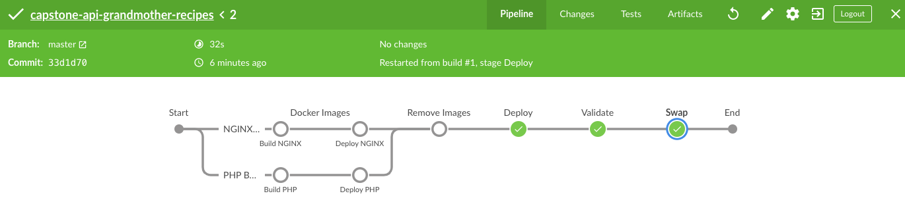

# About project

This project is part of the Udacity Nanodegree Program "Cloud DevOps Engineer". The objective is going to deploy an API using [blue-green](https://martinfowler.com/bliki/BlueGreenDeployment.html) strategy directly on Kubernetes.

This Application expose an API to register and show recipes.

## Requirements to run application

* PHP 7.1+
* MySQL 5.7+
* Composer 1.8+

You can find in official web sites of the [PHP](https://www.php.net/downloads.php#v7.1.32), [Composer](https://getcomposer.org/doc/00-intro.md), and [MySQL](https://www.mysql.com), how you can install required resources.

## How to run the application

You can run locally, using [Docker](https://www.docker.com/) or [Kubernetes](https://kubernetes.io).

* locally, directly in the host machine or server ([more details](./docs/how-to-run-application-locally.md))
* Docker, using continer engine ([more details](./docs/how-to-use-docker-to-application.md))
* Kubernetes, using a production-grade container orchestration ([more details](./docs/how-to-use-kubernetes-to-application.md))

You can see more details about [how the pipeline build the containers](./docs/how-to-pipeline-build-containers.md) using Jenkins.

## Deployment strategy

The project is using a blue-green deployment strategy to be deployed over a Kubernetes Cluster. There are some shell scripts `devops_deploy_app.sh`, `devops_deploy_validate.sh`, and `devops_deploy_swap.sh`, that are implementing required steps.

You can see more detail information about the implementation on [here](./docs/how-was-implemented-blue-green-deployment.md).

## Jenkins Pipeline

There is a Jenkins Pipeline, to use this in Continuous Integration and Continuous Delivery, [more details](./docs/how-to-execute-pipeline.md).

