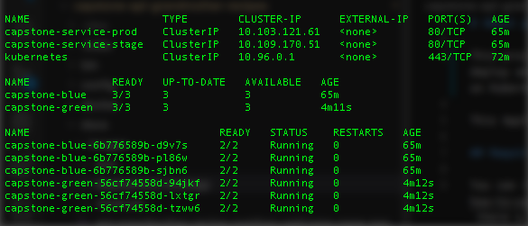

# About project

This project is part of the Udacity Nanodegree Program "Cloud DevOps Engineer". The objective is going to deploy an API using [blue-green](https://martinfowler.com/bliki/BlueGreenDeployment.html) strategy directly on Kubernetes.

This Application expose an API to register and show recipes.

## Requirements to run application

You can run this project [locally](./docs/how-to-run-application-locally.md), using [Docker](./docs/how-to-use-docker-to-application.md) or [Kubernetes](./docs/how-to-use-kubernetes-to-application.md). Bellow, there a list of the required resources to run this project.

* PHP 7.1+
* MySQL 5.7+
* Composer 1.8+

You can find in official web sites of the [PHP](https://www.php.net/downloads.php#v7.1.32), [Composer](https://getcomposer.org/doc/00-intro.md), and [MySQL](https://www.mysql.com), how you can install required resources.

## Deployment strategy

The project is using a [blue-green deployment](https://martinfowler.com/bliki/BlueGreenDeployment.html) strategy to execute in Kubernetes. There are some shell scripts `devops_deploy_app.sh`, `devops_deploy_validate.sh`, and `devops_deploy_swap.sh` to help to reach the deployment strategy goal.

You can find [here more information](./docs/how-to-use-shell-script-to-blue-green-deployment.md) about how to use shell scripts to help the deployment.

## Jenkins Pipeline

There is a Jenkins Pipeline, to use this in Continuous Integration and Continuous Delivery, you need [read this doc](./docs/how-to-execute-pipeline.md).

