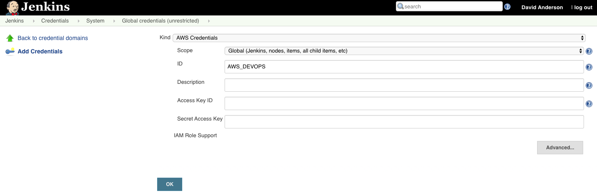
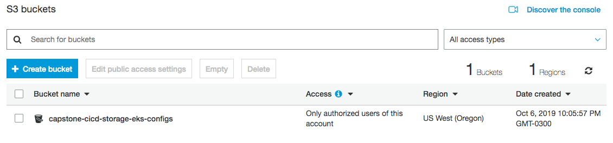
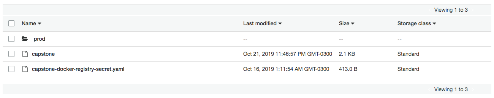
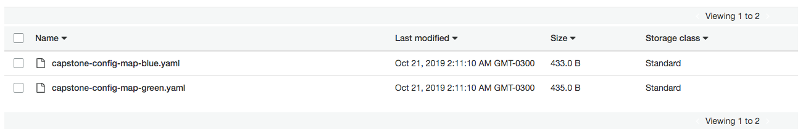

You need to have configure some resources to execute correctly this pipeline in Jenkins.

## Requirements

* [Jenkins AWS Pipeline](https://github.com/jenkinsci/pipeline-aws-plugin)

## How to execute

First, you need to create a new credential `AWS_DEVOPS` using AWS User Credentials.

Second, you have a S3 Bucket named `capstone-cicd-storage-eks-configs` in `us-west-2` region.

Third, you must have to a Kubernetes configuration file into of the S3 Bucket. For example `capstone`.

Fourth, you must have to a folder named `prod` into of the S3 Bucket. Inside of this folder, you need to upload the configuration map files used by the pods.

Finally, you need to connect your Jenkins with your SCM. After configure it, the first pipeline execution will index the branch and present for you a screen similar.

