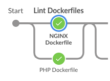
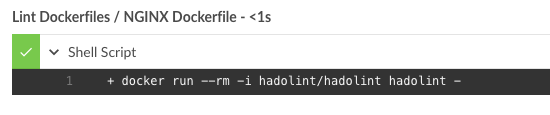
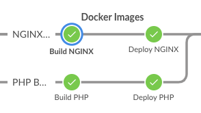
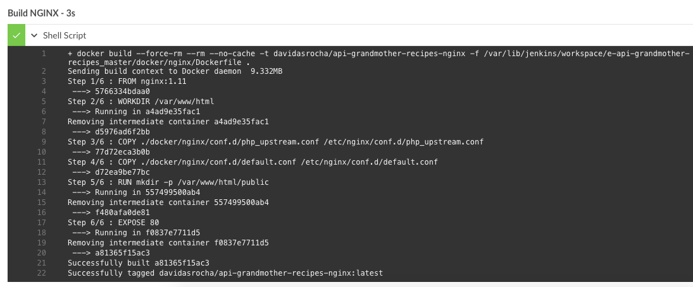
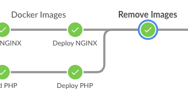
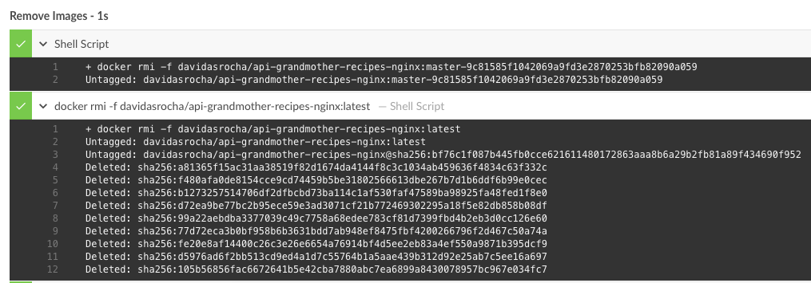

Pay attention, this application will be executed in production using the Docker containers, and to it, there are `two Dockerfiles`:

* `PROJECT_ROOT_PATH/docker/nginx/Dockerfile`
* `PROJECT_ROOT_PATH/docker/php/Dockerfile`

## How to the pipeline build the containers

The pipeline in this project, execute all steps to do Continuous Integration and Continuous Delivery, these steps including execute `lint`, `build` and `push` of the Docker images. Below, you can see more details.

In the first stage, the pipeline will execute the lint of the images:

To execute this lint, the pipeline stage will be using [Hadolint](https://github.com/hadolint/hadolint):

In the second stage, the pipeline will execute the build and the push of the images to a Docker registry:

To execute the build and push of the images, the pipeline stage will be using the docker engine:

In the last stage, the pipeline will remove the docker images from docker engine to keep the environment clean:

To remove the images, the pipeline stage will be using the docker engine:

After these stages, the pipeline will performer all steps to deploy images to Kubernetes.