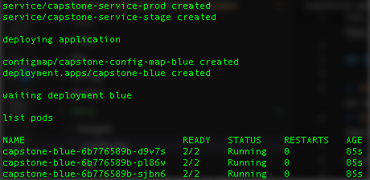

You can run this project using AWS EKS, pay attention, you should executed all steps required to [build and deploy](./how-to-build-application-in-docker.md) Docker images to a Docker registry.

## Requirements

* [AWS CLI 1.16.193+](https://aws.amazon.com/cli/), is a unified tool to manage your AWS services
* [eksctl](https://github.com/weaveworks/eksctl), is a simple CLI tool for creating clusters on EKS - Amazon's new managed Kubernetes service for EC2
* [kubectl](https://kubernetes.io/docs/tasks/tools/install-kubectl/), command-line tool, allows you to run commands against Kubernetes clusters
* S3 Bucket, store cluster configurations files, secrets files and configuration maps
* [AWS EKS](https://aws.amazon.com/eks/), makes it easy to deploy, manage, and scale containerized applications using Kubernetes on AWS

Configure these tool to continue.

## How to run

First, you must have configured a kubectl using EKS configuration file.
You can get this file after create a cluster using [eksctl](https://github.com/weaveworks/eksctl), and save this file to path `~/.kube/config`.

Now, you are going to deploy the application to AWS EKS running this command:

```
./devops_deploy_app.sh project-name docker-image-tag LoadBalancer
```



### How to configure Docker registry and Service Account

If you want to use a private Docker registry, you can execute below steps after first step.

You need to create a secret to Docker registry, run this command:

```
kubectl create secret docker-registry capstone-docker-registry-secret \
    --docker-username=DOCKER-USERNAME \
    --docker-password=DOCKER-PASSWORD \
    --docker-email=DOCKER-EMAIL
```

And, you need to configure a service account, run this command:

```
kubectl patch serviceaccount default -p '{"imagePullSecrets": [{"name":"capstone-docker-registry-secret"}]}'
```
