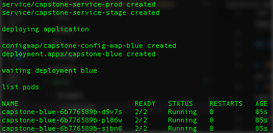

You can run this project using Minikube, pay attention, you should executed all steps required to [build and deploy](./how-to-build-application-in-docker.md) Docker images to a Docker registry.

## Requirements

* [Minikube](https://kubernetes.io/docs/tasks/tools/install-minikube/), minikube implements a local Kubernetes cluster on macOS, Linux, and Windows
* [kubectl](https://kubernetes.io/docs/tasks/tools/install-kubectl/), command-line tool, allows you to run commands against Kubernetes clusters

Configure these tool to continue.

## How to run

First, you need to run below command to start cluster:

```
minikube start
```

Second, this is a optional step only if you want to use a private Docker registry, run this command:

```
// first command to create secret

kubectl create secret docker-registry capstone-docker-registry-secret \
    --docker-username=DOCKER-USERNAME \
    --docker-password=DOCKER-PASSWORD \
    --docker-email=DOCKER-EMAIL

//second command to configure service account

kubectl patch serviceaccount default -p '{"imagePullSecrets": [{"name":"capstone-docker-registry-secret"}]}'
```

Third, you are going to deploy the application to Minikube Cluster running this command:

```
./devops_deploy_app.sh project-name docker-image-tag NodePort
```



Finally, you can get the endpoint to access the application running this command:

```
minikube service capstone-service-prod --url
```