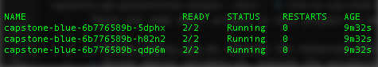
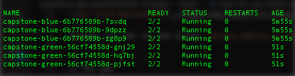
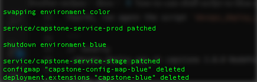

There are some shell scripts in this project to help you to execute the blue-green deployment.

* `devops_deploy_app.sh`, execute resources deployment between blue and green environment, and spend a short-term until minimum pods are available
* `devops_deploy_validate.sh`, execute the validations against stage environment
* `devops_deploy_swap.sh`, execute the swap between blue and green environment

## How to use scripts

First, you can run the script `devops_deploy_app.sh`:

```
// locally
./devops_deploy_app.sh capstone 1.0.0 NodePort

// for aws
./devops_deploy_app.sh capstone 1.0.0 LoadBalancer
```



Second, you can run the script `devops_deploy_validate`:

```
// for aws
./devops_deploy_validate.sh capstone
```

Third, you can run the script `devops_deploy_swap.sh`:

```
./devops_deploy_swap.sh capstone
```


Fourth, run again the script `devops_deploy_app.sh`:

```
// locally
./devops_deploy_app.sh capstone 2.0.0 NodePort

// for aws
./devops_deploy_app.sh capstone 2.0.0 LoadBalancer
```



Fiveth, run again the script `devops_deploy_validate`:

```
// for aws
./devops_deploy_validate.sh capstone
```

Finally, run again the script `devops_deploy_swap.sh`:

```
./devops_deploy_swap.sh capstone
```



All these scripts are in use by Jenkins Pipeline included in this project.