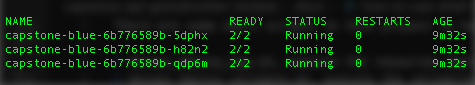
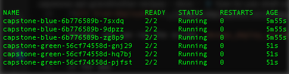
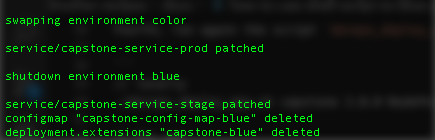

To execute the blue-green deployment, was implemented in the project some shell scripts to orchestract interaction with Kubernetes.

* `devops_deploy_app.sh`, execute resources deployment between blue and green environment, and spend a short-term until minimum pods are available
* `devops_deploy_validate.sh`, execute the validations against stage environment
* `devops_deploy_swap.sh`, execute the swap between blue and green environment

## How was implemented deployment and how to use scripts

In the first step, will occur verification to find if there is some previous deployment to continue, on this step is chosen the environment color, by default, blue is the first color.

To start, you can run the script `devops_deploy_app.sh`:

```
// locally
./devops_deploy_app.sh capstone 1.0.0 NodePort

// for aws
./devops_deploy_app.sh capstone 1.0.0 LoadBalancer
```



In the second step, will occur deployment validation, the script will identify how is the environment to execute an HTTP request using cURL to assurance that deployment occurred correctly.

In the case of occurring some errors in the deployment, it is aborted, and resources used removed.

You can run the script `devops_deploy_validate`:

```
// for aws
./devops_deploy_validate.sh capstone
```

In the third step, will be the swap between the environment, in the case, there is a single environment deployed, the swap is skipped.

You can run the script `devops_deploy_swap.sh`:

```
./devops_deploy_swap.sh capstone
```


In the fourth step, you will deploy a new application version, again will occur verification to find if there is some previous deployment to continue, on this step is chosen the staging environment color.

You can run the script `devops_deploy_app.sh`:

```
// locally
./devops_deploy_app.sh capstone 2.0.0 NodePort

// for aws
./devops_deploy_app.sh capstone 2.0.0 LoadBalancer
```



In the fifth step, again, will occur deployment validation, script will be executing an HTTP request using cURL to assurance that deployment occurred correctly.

In the case of occurring some errors in the deployment, it is aborted, and resources used removed.

You can run the script `devops_deploy_validate`:

```
// for aws
./devops_deploy_validate.sh capstone
```

In the last step, again, will be a swap between the environments.

You can run the script `devops_deploy_swap.sh`:

```
./devops_deploy_swap.sh capstone
```



All these scripts are in use by [Jenkins Pipeline](./how-to-execute-pipeline.md) included in this project.